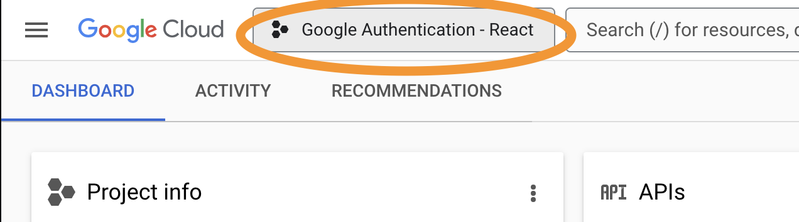

# Google Authentication with React 

## Objective
Learn how to setup Google Authentication

## Steps
1. setup a React app with Vite
  `npm create vite@latest`
2. Create a name
3. Select React
4. Select Javascript
5. cd into the project
6. open it up in VSCode
7. `npm install`
8. `npm run dev` Make sure you have a basic react up and running.

    For Google Authentication utilizing [react oauth2google docs](https://www.npmjs.com/package/@react-oauth/google)
  9. Run this to install `npm install @react-oauth/google@latest react-router`
  10. Goto http://console.cloud.google.com/ to set up a free account
  11. Once you create a free account, you are allowed to have 11 apps a quota, I just renamed the first one it automatically created. Or you can create a new one.
  - [ ] 11.a. To rename
    - [ ] 11.a.1 On your dashboard 
    - [ ] 11.a.2 Click on the project name  
    - [ ] 11.a.3 Under project info, click on goto project settings.   
    - [ ] 11.a.4 Change the name there.  
  - [ ] 11.b To create
    - [ ] 11.b.1 Refer to the image below click on this button, the name could be a different project name in there. 
    
    - [ ] Press New Project on the top right hand corner
    - [ ] Create a new project name
12. Once you have your project, goto the dashboard. then click on the hamburger menu.
13. Hover over "APIs & Services" and click on "Credentials"
14. At the top of the screen click on "+ Create Credentials" and then click on "OAuth client ID".
15. In Application type, select "Web Application"
16. In Name, creat a simple name. eg. "React App"
17. In Authorized JavaScript origins, add two things 
  - [ ] In URL 1 add `http://localhost`
  - [ ] In URL 2 add `http://localhost:5173`
18. Press create
19. Goto the hamburger menu, hover over "APIs & Services" and click on "Oauth consent screen"
20. You should already have a project, select "Audience"
21. Goto "Test users" section, add any users that you want to have access to testing.
22. Click on Clients
23. Copy the Client ID
24. Goto VScode
25. at the top of `main.jsx`, right above "createRoot" add `import { GoogleOAuthProvider } from '@react-oauth/google'`
27. Between StrictMode and App, wrap App up with `<GoogleOAuthProvider>`
so it should look like this: 
``` 
createRoot(document.getElementById('root')).render(
  <StrictMode>
    <GoogleOAuthProvider>
      <App />
    </GoogleOAuthProvider>
  </StrictMode>,
)
```
28. Before createRoot add `const CLIENT_ID="CLIENT_ID_YOU_COPIED"` if you are going to actually use this, we should not be plugging in the id here, use dotenv to hide it. 
29. In your "GoogleOAuthProvider" opening tag add `clientId = CLIENT_ID` so now your main.jsx should look like this: 
```
import { StrictMode } from 'react'
import { createRoot } from 'react-dom/client'
import './index.css'
import App from './App.jsx'
import { GoogleOAuthProvider } from '@react-oauth/google'

const CLIENT_ID = "132242362761-cp87epcf24oivlvtrt9tb0r70jbgkprd.apps.googleusercontent.com"
createRoot(document.getElementById('root')).render(
  <StrictMode>
    <GoogleOAuthProvider clientId={CLIENT_ID}>
      <App />
    </GoogleOAuthProvider>
  </StrictMode>,
)

```
30. Goto the page you are wanting the login page to be and add the following
``` 
export default function GoogleLanding() { 
  return (
    <>
      {/* renders the google login form */}
      <GoogleLogin 
        // If successfully logged in 
        onSuccess={(loginInfo) =>{
          console.log(loginInfo);
        }}
        //If not successfully logged in
        onError={() => alert("Login Failed")}
      />
    </>
  )
}
```
31. In your `app.jsx`, it should look like this:
```
import './App.css'
import { HashRouter, Routes, Route } from 'react-router-dom'
import GoogleLanding from './GoogleLanding'
function App() {

  return (
    <HashRouter>
      <Routes>
        <Route path="/" element={<GoogleLanding />}/>
      </Routes>
    </HashRouter>
  )
}

export default App
```

At this point you should see the Google login button and when you click on it, it should allow you to login and it will display your credentials info in your console. However, it does not display the name, email etc, because it is in a json formatt inside `credentials`
